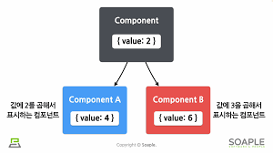
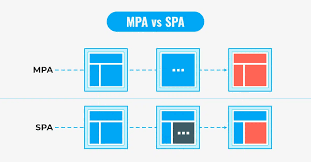
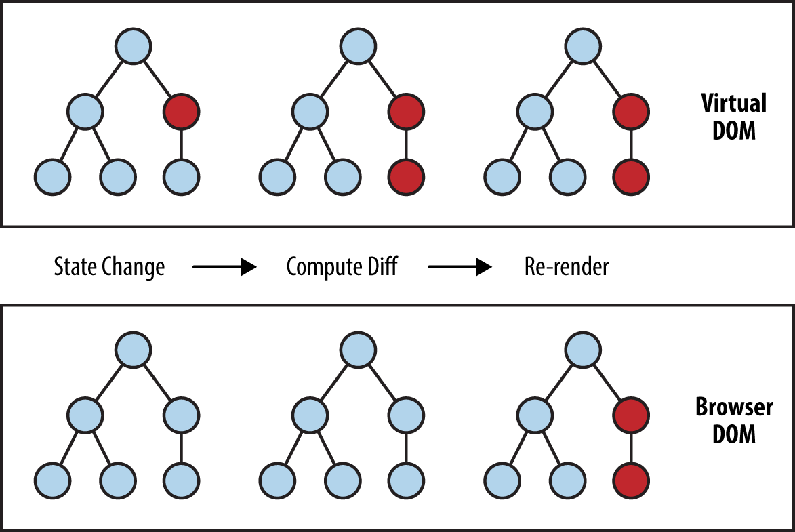

# 최상현 202030138

## React1 13주차 수업(05.29)
1. 여러 개의 입력 다루기 - 여러 개의 state를 선언하여 각각의 입력에 대해 사용
    ```jsx
    const [haveBreakfast, setHaveBreakfast] = useState(true);
    const [numbeOfGuest, setNumberOfGuset] = useState(2);


    ```

2. Input Null Value
    ```jsx
        <input value={null} />
        <input placeholder="초기입력안내메시지">
    ```
    * 제어 컴포넌트에 value prop을 정해진 값으로 넣으면 코드를 수정해야 값을 바꿀 수 있다. 이것을 자유롭게 입력할 수 있도록 하고 싶다면 값을 undefined 또는 null을 넣으면 된다.
    * **하지만 이런 용도로 사용할 때는 placeholder가 훨씬 낫다**

3. Shared State
    * 
    * 공유된 State - 하위 컴포넌트가 공통된 부모 컴포넌트의 state를 공유하며 사용
    * 어떤 컴포넌트의 state에 있는 데이터를 여러 개의 하위 컴포넌트에서 공통적으로 사용하는 경우


## React1 12주차 수업(05.22)
1. 리스트와 키
    1. 리스트 - 자바 스크립트의 변수나 객체를 하나의 변수로 묶어 놓은 배열과 같은 것.
    2. 키 - 각 객체나 아이템을 구분할 수 있는 고유한 값
    * 리액트에서는 배열과 키를 사용하는 반복되는 다수의 엘리먼트를 쉽게 렌더링할 수 있음.

2. MAP 함수의 사용 예 **!굉장히 중요!**
    ```jsx
    const numbers = [1, 2, 3, 4, 5];

    const listItems = numbers.map((number) =>
        <li>{number}</li>
    )
    ```

3. 리스트의 키 조건
    * 키는 리스트에서 어떤 아이템이 변경, 추가, 제거 되었는지 구분하기 위해 사용
    * 키는 같은 리스트에 있는 엘리먼트 사이에서만 고유한 값이면 오케이

4. 키의 종류
    1. 숫자 사용 - 리스트의 값을 숫자로 사용(숫자 중복 시 risk가 너무 큼.)
    2. id 값 사용 - 리스트를 만들 때 id 값을 따로 생성(주식별자 역할)
    3. index 사용 - 리스트의 index를 map함수에 활용(기본 값)

5. 폼(form) - 일반적으로 사용자로부터 입력을 받기 위해 사용
    ```jsx
    <form action = "전송할 주소" method = "post">   // action 속성 등 무언가 하려면 속성이 필요
        <input ... >
        <input type="submit">
    </form>
    ```

6. 제어 컴포넌트
    * 사용자가 입력한 값에 접근하고 제어할 수 있도록 해주는 컴포넌트
    * 제어 컴포넌트에서는 모든 데이터를 state에서 관리.

7. textarea 태그 - HTML에서와 다르게 싱글 태그로 사용됨
    ```jsx
    <textarea value = {value} onChange = {handleChange} />
    ```

8. select 태그 - 드롭다운 목록을 보여주는 태그
    ```jsx
    <select>
        <option value = ".."></option>
        <option value = ".."></option>
        <option value = ".."></option>
        <option value = ".."></option>
    </select>
    ```

9. File Input 태그 - 서버로 파일을 업로드하거나 자바 스크립트의 API를 사용해서 파일을 다룰 때 사용(읽기 전용이기 때문에 리액트에서는 비제어 컴포넌트가 됨.)


## React1 10주차 수업(05.08)
1. Arguments 전달하기
    * Parameter(함수 정의) - 함수에서 활용할 입력값, 매개변수
    * Arguments(함수 사용) - 함수에 주장할 내용, 인수

2. 조건 부 렌더링
    * 조건에 따라서 렌더링이 달라지는 것
    ```jsx
        if (조건절) {
            return <렌더링/>
        }
        return <렌더링/>
    ```

3. 엘리먼트 변수
    * 리액트 앨리먼트를 컴포넌트 변수처럼 사용하는 것
    * 조건절에 따라 변수에 컴포넌트를 대입하여 사용

4. Truthy와 Falsy
    * Truthy - true는 아니지만 true로 여김(true, {}, [], number(0 제외), string)
    * Falsy - false는 아니지만 false로 여김(false, 0, -0, 0n, empty sting, null, undefiend, Not a Number)

5. 인라인 조건
    * if문을 직접 사용하지 않고, 동일한 효과를 내기 위해 && 논리 연산자를 사용
    * 모든 조건이 참일 때만 참
    * 따라서 첫 조건이 거짓이면 뒤 조건은 판단 필요 X. 반대로 첫 조건이 참이면 뒤 조건만 판단하기
    * 이를 활용하여 앞의 조건문의 참 거짓 여부에 따라 뒤의 컴포넌트의 렌더링 여부 결정
    * ***주의 사항: 조건문에 Falsy Expression을 사용하면 뒤에 나오는 Expression은 평가되지 않지만 Falsy Expression의 결과값이 그대로 리턴된다.***

6. 인라인 If-Else
    * if-else문을 필요한 곳에 직접 넣어서 사용하는 방법
    * 조건문의 값에 따라 다른 엘리먼트를 보여줄 때 사용
    * 삼항 연산자(조건문 ? 참 : 거짓) 사용

7. 컴포넌트 렌더링 막기 - return null 사용 ㅋㅋ;


## React1 9주차 수업(05.01)
1. 훅의 규칙
    1. 무조건 최상위 레벨에서만 호출해야 한다.(root에서만 사용해야함.)
        * 반복문이나 조건문 또는 중첩된 함수들 안에서 훅을 호출해서는 안됨.
        * 훅은 컴포넌트가 렌더링될 때마다 매번 같은 순서로 호출되어야함.
    2. 함수형 컴포넌트에서만 훅을 호출해야함.
        * 일반 자바스크립트 함수에서 훅을 호출하면 안됨.
        * 함수형 컴포넌트 혹은 직접 만든 커스텀 훅에서만 호출할 수 있음.

2. 커스텀 훅(Custom Hook) - 리액트에서 기본적으로 제공되는 훅들 이외에 추가적으로 필요한 기능이 있을 경우 직접 만들어 사용하는 훅.

3. 커스텀 훅 추출하기
    * 이름은 use로 시작
    * 다른 훅을 호출하는 것은 무조건 커스텀 훅의 최상위 레벨에서만 해야함
    * 당연히 import 시켜야함.

4. DOM과 리액트에서 클릭 이벤트를 처리하는 예제 코드
    ```jsx
    <button onclick="activate()">
        Active
    </button>
    ```
    ```jsx
    <button onClick ={activate}>
        Active
    </button>
    ```
    * 이벤트 이름이 onclick에서 onClick으로 변경
    * 전달하려는 함수는 문자열에서 함수 그대로 전달

5. 이벤트 핸들러 - 인벤트가 발생했을 때 해당 이벤트를 처리하는 함수.(이벤트 리스너)


## React1 7주차 수업(04.17)
1. 훅이란 무엇인가?
    * 함수형 컴포넌트에서도 state나 생명주기 함수의 기능을 사용하게 해주기 위해 추가된 기능
    * state와 생명주기 기능에 갈고리를 걸어 원하는 시점에 정해진 함수를 실행되도록 만든 함수
    * 훅의 이름은 use로 시작할 것.(사용자 정의 훅(custom hook)을 만들어 이름을 자유롭게 지을 순 있으나 use로 시작할 것 권장)

2. useState
    * 함수형 컴포넌트에서 state를 사용하기 위한 Hook
    * state 사용하면 카운트가 증가하더라도 재 렌더링은 일어나지 않는다. 따라서 useState()를 사용
    ```jsx
    import React, { useState } from "react";
    ```
    ```jsx
    const [변수명, set함수명] = useState(초깃값);
    ```

3. useEffect
    * 사이드 이펙트(Side Effect)를 수행하기 위한 훅
    * 서버에서 데이터를 받아오거나 수동으로 DOM을 변경하는 작업 등에 사용
    * 클래스 컴포넌트의 생명주기 함수와 같은 기능을 하나로 통합한 기능 제공
    * Side Effect는 원래의 용도 혹은 목적의 효과외에 부수적으로 다른 효과가 있는 것을 뜻함.
    ```jsx
    useEffect(이펙트 함수, 의존성 배열);    // 굉장히 헷갈림
    ```
    의존성 배열 - 배열 안에 있는 변수 중에 하나라도 값이 변경되었을 때 이펙트 함수가 실행됨
    * 빈 배열 - 이펙트 함수가 마운트와 언마운트 될 때 한번씩만 실행됨

4. useMemo
    * Memoized value를 리턴하는 훅
    * 이전 계산값을 갖고 유지하기 때문에 연산량이 많은 작업의 반복을 피할 수 있다.
    * 렌더링이 일어나는 동안 실행(따라서 렌더링이 일어나는 동안 실행하면 안되는 작업을 넣으면 안됨.)
    ```jsx
    const memoizedValue = useMemo(
        () => {
            return computeExpensiveValue(의존성 변수1, 의존성 변수2);
        },
        [의존성 변수1, 의존성 변수2]
    )
    ```
    빈 배열은 사용하나 의존성 배열을 생략한다면 컴포넌트 업데이트 시마다 실행되기 때문에 필요가 없어진다.

5. useCallback
    * useMemo()와 유사한 역할을 하지만 차이점은 값이 아닌 함수를 반환함
    * 의존성 배열을 파라미터로 받음
    * 콜백 - 파라미터로 받은 함수
    * 의존성 배열 중 하나라도 변경되면 콜백함수를 반환함.

6. useRef
    * 레퍼런스를 사용하기 위한 훅
    * 레퍼런스 - 특정 컴포넌트에 접근할 수 있는 객체
    * 레퍼런스 객체를 반환
    * 반환된 레퍼런스 객체는 컴포넌트의 라이프타임 전체에 걸쳐서 유지됨.
    ```jsx
    const refContainer = useRef(초깃값);
    ```
    레퍼런스 객체의 current 속성 - 참조하고 있는 앨리먼트

7. callback ref
    * 자식 컴포넌트가 변경되었을 때 알림을 받을 수 있고, 이를 통해 다른 정보들을 업데이트할 수 있다. 


## React1 5주차 수업(04.03)
1. Props 사용법
    * JSX 에서는 key-value쌍으로 props 구성
    ```jsx
    function App(props) {
        return (
        <Profile
            name = "소플"
            introduction = "안녕하세요, 소플입니다."
            viewCount={1500}
        />
        );
    }
    ```
    profile 컴포넌트에 name, introduction, viewCount 속성 전달.
    * 중괄호를 사용하여  props 값으로 문자열, 정수, 변수, 다른 컴포넌트를 넣을 수 있음.

2. 컴포넌트 종류
    * 클래스 컴포넌트 - 초기 버전에서 사용
    * 훅(Hook) - 함수형 컴포넌트
    * *클래스 컴포넌트와 컴포넌트 생명주기 추후 학습할것*

3. 함수형 컴포넌트 - 굉장히 간단함. props 객체를 받아 리액트 앨리먼트를 리턴

4. 클래스 컴포넌트
    * React.Component라는 클래스를 상속받아 사용
    * render() 함수 필수 사용

5. 컴포넌트 이름 짓기
    * 항상 대문자로 시작 - 리액트는 소문자로 시작하는 컴포넌트를 DOM태그로 인식
    * 컴포넌트 파일 이름 == 컴포넌트 이름(클래스와 동일)

6. 컴포넌트 렌더링
    * 컴포넌트 >>(제작)>> 엘리먼트 >> 화면 출력

7. 컴포넌트 합성
    * 여러 개의 컴포넌트를 합쳐서 하나의 컴포넌트를 만드는 것
    * 컴포넌트 안에 또 다른 컴포넌트를 사용할 수 있기 때문에 복잡한 화면을 여러 개의 컴포넌트로 나눠서 구현할 수 있음
    * props 값을 다르게 해서 같은 컴포넌트를 여러 번 사용

8. 컴포넌트 추출
    * 큰 컴포넌트에서 일부를 추출해 새로운 컴포넌트를 만드는 것
    * 컴포넌트가 작아질수록 기능과 목적이 명확해지고, props도 단순해짐.
    * 재사용성이 올라가며 개발 속도도 향상.
    * 기능 단위로 구분하고, 추후에 곧바로 재사용이 가능한 형태로 추출

9. State
    * 리액트 컴포넌트의 데이터의 상태
    * 컴포넌트의 변경 가능한 데이터
    * State가 변하면 다시 렌더링이 되기 때문에 렌더링과 관련된 값만 state에 포함시켜야함.

10. State의 특징
    * 자바스크립트 객체
    * 렌더링이나 데이터 흐름에 사용되는 값만 state에 포함시켜야함.
    * setstate() 함수를 사용해야지, 직접 변경해서는 안됨.

11. 생명 주기
    * 컴포넌트가 생성되는 시점과 사라지는 시점
    * 생명 주기 함수(Lifecycle method)에 의해 진행
    * **컴포넌트는 계속 존재하는 것이 아니라 시간의 흐름에 따라 생성되고 업데이트되다가 사라짐**
    1. 마운트 - 출생, constructer에 의해 state 정의. 컴포넌트 렌더링 이후 componentDidMount() 호출
    2. 업데이트 - props변경, setState()로 state 변경, forceUpdate()로 컴포넌트 재렌더링, 렌더링 이후 componentDidUpdate() 호출
    3. 언마운트 - 상위 컴포넌트에서 현재 컴포넌트를 더 이상 화면에 표시하지 않을 때 언마운트됨. 언마운트 직전에 componentWillUnmount() 호출
    


## React1 4주차 수업(03.27)
1. JSX - A syntax extension to JavaScript. 자바 스크립트의 확장 문법.
    * *JavaScript and XML의 줄임말*
2. JSX의 역할
    * createElement() 함수 - JSX 코드를 자바스크립트로 변환
    * 코드 간결화, 생산성과 가독성 개선
    * 자바스크립트만을 가지고 createElement() 함수를 이용하여 작성하여도 무방하나 위와 같은 이유로 JSX 사용 권장
3. JSX의 장점
    * 코드가 간결해짐.
    * 가독성이 향상됨.
    * Injection Attack 해킹을 방어함으로서 보안성 강화
4. JSX 사용법
    * 모든 자바스크립트 문법을 지원하며 여기에 XML과 HTML을 섞어 사용
    * 큰따옴표 사이에 문자열 삽입
    * 중괄호 사이에 자바스크립트 코드 삽입
        * **JSX에서는 중괄호 사용 시 거의 무조건 자바스크립트가 들어감**
5. 엘리먼트의 정의 - 리액트 앱의 가장 작은 빌딩 블록
    * HTML 요소
    * 리액트 엘리먼트 : DOM 엘리먼트의 가상 표현으로 부분적인 정보 전달을 하기 때문에 DOM 엘리먼트에 비해 가볍다.
6. 엘리먼트의 생김새 - 자바 스크립트의 객체 형태로 존재
    ```js
    React.createElemet(
        type,
        [props],
        [...children]
    )
    ```
    VV아래로 변경(JS > JSX)VV<br><br>
    ```jsx
    {
        type: Button,
        props: {
            color: 'green',
            children: 'Hello, element!'
        }
    }
    ```
7. 앨리먼트의 특징
    * 불변성 - 변하지 않는 성질. 앨리먼트 생성 후에는 children이나 attributes를 변경할 수 없음. 갱신이 필요하다면 새로 생성해서 기존 앨리먼트와 교체해야함.
8. 앨리먼트 렌더링
    ```jsx
    <div id = "root"></div>
    ```
    root DOM node로서 모든 리액트 앨리먼트들이 이 안에 렌더링 됨.
    ```jsx
    const root root = ReactDOM.createRoot(document.getElementById('root'));
    root.render(element);
    ```
    root div에 렌더링하는 함수(암기)    
9. 렌더링 앨리먼트 업데이트
    * 자바스크립트의 setInterval() 함수를 사용해서 tick()함수를 매초 호출
    * tick() 함수가 호출될 때마다 기존 앨리먼트를 새로운 앨리먼트를 생성하여 변경시킴.
10. 컴포넌트
    *  리액트는 모든 페이지가 컴포넌트로 구성되어 있고, 하나의 컴포넌트는 또 다른 여러개의 컴포넌트로 구성됨.
    * 컴포넌트는 재사용 가능하기에 전체 코드의 양을 줄일 수 있어 개발시간과 유지보수 비용도 줄일 수 있음.
    * 컴포넌트의 입력은 props가 담당하고 출력은 리액트 앨리먼트의 형태로 출력됨
    
11. Props - 리액트 컴포넌트의 속성
    * *붕어빵의 속재료와 비슷한 느낌*
    * 같은 리액트 컴포넌트에서 눈에 보이는 글자나 색깔 등의 속성을 바꾸고 싶을 때 사용하는 컴포넌트의 속 재료
    * 컴포넌트에 전달할 다양한 정보를 담고 있는 자바스크립트 객체
12. Props의 특징
    * Read-Only(변경 불가)
    * 속성이 다른 앨리먼트를 생성하려면 새로운 props를 컴포넌트에 전달시켜야함.
    * Pure 함수와 Impure 함수
        1. Pure 함수 - 입력값을 변경하지 않으며, 같은 입력값에 대해서는 항상 같은 출력값을 낸다.(함수 내부에서 변경 X)
        2. Impure 함수 - 입력으로 받은 파라미터 값을 변경할 수 있음.(함수 내부에서 변경 O)
    리액트 컴포넌트는 Pure 함수의 역할을 한다.


## React1 3주차 수업(03.20)
1. 리액트의 정의
    * 리액트 - 웹과 네이티브 사용자 인터페이스를 위한 라이브러리
    * 자주 사용되는 기능을 정리해 모아놓은 것(즉, 사용자 인터페이스(UI)를 만들기 위한 기능 모음집, UI Library)<br>
        * *UI(User Interface) - 사용자와 컴퓨터 프로그램이 서로 상호 작용을 위해 중간에서 서로 간에 입력과 출력을 제어해주는 것*
2. 다양한 자바스크립트 UI 프레임워크
    * 앵귤러JS, VueJS 등 여러개의 UI 프레임워크들이 있지만 현재 가장 많이 사용되는 것은 수업에서 배울 **React**
3. 리액트 개념 정리
    * 사용자와 웹사이트의 상호작용을 돕는 인터페이스를 만들기 위한 자바스크립트 기능 모음집
    * 복잡한 사이트를 쉽고 빠르게 만들고 관리하기 위해 만듬
    * SPA를 쉽고 빠르게 만들 수 있도록 해주는 도구<br>
        * *SPA(Single Page Application) - 단일 페이지 어플리케이션으로 각 페이지를 HTML로 새로 만드는 MPA에 비하여 효율적이고 관리도 쉬움.<br>*
        
4. 리액트의 장점
    1. 빠른 업데이트와 렌더링 속도
    2. 가상 DOM(Virtual DOM) - 화면이 업데이트 된다는 것은 DOM이 수정 된다는 것. 기존의 브라우저 DOM을 사용할 경우 동기식 되기에 DOM을 직접 수정하게 되어 성능에 영향을 크게 미치고 비용도 굉장히 커짐. 하지만 가상 DOM을 사용하는 React의 경우 비동기식으로 처리되어 업데이트해야할 최소한의 부분만 검색하여 수정<br>
    
        * *DOM(Document Object Model) - 웹사이트에 대한 정보를 담고 있는 객체*
    3. 컴포넌트 기반 구조 - 모든 페이지가 컴포넌트로 구성되고, 하나의 컴포넌트는 다른 컴포넌트로 구성됨.*(작은 레고 블럭들을 모아 하나의 모형을 완성하는 느낌)*
        * *컴포넌트 - 하나의 틀을 만들어 반복적으로 사용이 가능(후술할 4번째 장점과 연결)*
    4. 재사용성 - 다시 사용이 가능한 성질
        * 반복적인 작업을 줄여주어 생상성 상승
        * 유지보수 용이
        * **주의 - 의존성이 없어야함.**
    5. 든든한 지원군 - 메타(구 페이스북)의 오픈소스 프로젝트로 발전 지속
    6. 활발한 지식 공유 & 커뮤니티 - Github, 메타 등의 의사소통 플랫폼
    7. 모바일 앱 개발 가능 - 리액트 네이티브로 크로스 플랫폼
5. 리액트의 단점
    1. 방대한 학습량 - 꾸준한 업데이트, 자바 스크립트 등의 추가 공부
    2. 높은 상태 관리 복잡도 - state, life cycle 등의 개념(공부를 해봐야 알수 있음)
6. create-react-app 만들기
    * 프로젝트 생성 명령어: **npx create-react-app <프로젝트이름>**
        * *4058 오류 발생 시 - 최신 버전으로 변경(npm install -g npm@latest) 후 프로젝트 생성*
        * *4077 오류 발생 시 - 삭제 후(npm uninstall -g create-react-app) 재설치 (npm install -g create-react-app)*
    * 프로젝트 실행 명령어: **npm start**
    * public의 index.html의 루트 아이디에 전송
    * 메인 컴포넌트는 App.js에 작성하고 return안에는 하나의 태그만 전송가능(주로 div로 묶어서 전송)
    * 프론트 개발 시에는 시멘틱 태그 사용할 것(header, body, footer 등)
    * index.js에서는 App을 import 시킨후 React.StrictMode에 App을 넣어 index.html의 root로 전송하는 내용으로 구성됨.(구조만 이해. 외울 필요 X)
    * xml 느낌으로 싱글 태그라면 <~/>라고 명확히 작성해야함.
    * package.json에는 모듈에 들어갈 자료들이 적혀있음 package-lock.json에는 더 상세한 내용이 들어가있음. scripts에는 축약된 명령어들이 포함되어있음. npm install 명령어를 통해 package의 모듈들을 참고하여 모듈 다운. 패키지의 모듈 폴더를 전부 삭제하고, 캐시도 삭제(npm cache clean -force)한 후에 npm install로 설치하면 의존성 문제 해결


## React1 2주차 수업(03.13)
git과 관련 내용 공부<br>
- LICENSE(법적 내용)
- .gitignore의 기능(업로드하지 않을 파일들을 설정 가능)
- README 파일에선 최근 내용을 먼저 볼 수 있게 만들 것